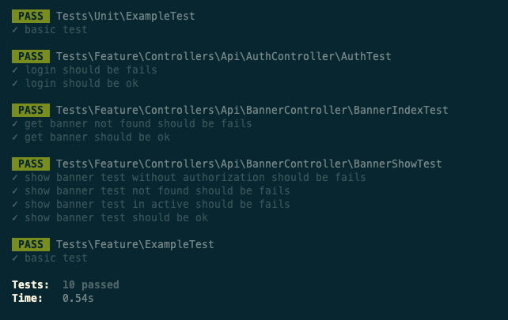

## Demo


# Laravel 8

```
composer install
```
```
npm install
```
```
cp .env.example .env
```
```
php artisan key:generate
```
```
php artisan migrate
```
```
php artisan db:seed
```
```
php artisan serve
```

## Run Test
```
php artisan test
```
